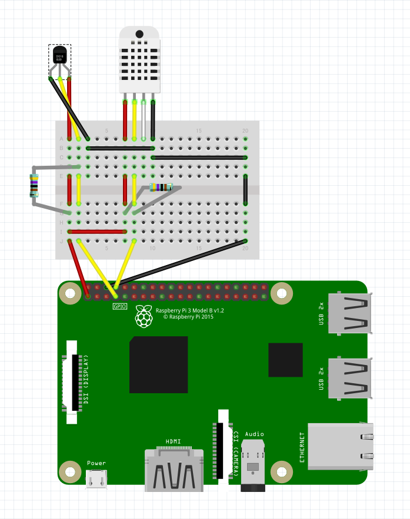

# 自宅ネットワーク環境構築
Ansibleを使いネットワークまわりの設定を行う。

# 前提手順
## DNS兼DHCP Server
1. Raspbianをインストールする。 
2. bootディレクトリにsshという名前の空ファイルを作成し、SSH接続できるようにする。
3. ネットワーク設定を行う。
    - IPアドレスは 10.0.0.2で固定しておく  
        /etc/dhcpcd.confに以下を追記してreboot。
        ```
        interface eth0
        static ip_address=10.0.0.2/20
        static routers=10.0.0.1
        ```
    - 公開鍵認証でpiユーザーにログインできるようにする。
        * RaspberryPiの/.ssh/authorized_keysに公開鍵を保存する。
        * Ansibleを実行する側の./raspi_dhcp/ssh_keys/raspberrypi.keyに秘密鍵を保存する。(OpenSSH形式)

## DHCP通知用設定
SlackにDHCP割当通知を行うための設定を行う。
1. SlackでAppとそのIncoming Webhook URLを生成しておく。
2. Ansibleを実行する側の 
    ```
    ./raspi_dhcp/services/dhcp_assign_notifier/common/constants_default.py
    ```
    を
    ```
    ./raspi_dhcp/services/dhcp_assign_notifier/common/constants.py
    ```
    にコピーして、WEBHOOK_URLに投稿先SlackのIncoming Webhook URLを代入する。

## アクアリウム用Raspi

1. 以下のものを準備する。
    - DHT22(AM2302)
    - DS18B20
    - 4.7KΩ抵抗2つ
1. 組み立てる。  
    
1. Raspbianをインストールする
1. bootディレクトリにsshという名前の空ファイルを作成し、SSH接続できるようにする。
1. bootディレクトリに無線LAN接続用にwpa_supplicant.confを用意する。

    ``` config
    country=JP
    ctrl_interface=DIR=/var/run/wpa_supplicant GROUP=netdev
    update_config=1
    network={
        ssid="{{ssid}}"
        psk="{{pw}}"
    }
    ```

1. bootディレクトリのconfig.txtに一行追記する

    ``` config
    dtoverlay=w1-gpio-pullup,gpiopin=4
    ```

1. ネットワーク設定を行う。
    - 公開鍵認証でpiユーザーにログインできるようにする。
        * RaspberryPiの/.ssh/authorized_keysに公開鍵を保存する。
        * Ansibleを実行する側の./aquarium/ssh_keys/aquapi.keyに秘密鍵を保存する。(OpenSSH形式)
# 実行 (初回のみ。2回目以降はGitHubにpushするとJenkinsが実施してくれる。)
```
sh execute.sh
```

# Ansible実行後にやること
 - アクアリウム用Raspiで、以下のコマンドを実行
    ```
    git clone https://github.com/adafruit/Adafruit_Python_DHT.git
    cd Adafruit_Python_DHT
    sudo python3 setup.py install
    ```
 - Jenkinsにパイプライン構築